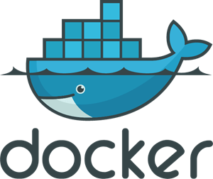

-------

<h1>Hi there 👋 I'm Hector!</h1>

<h2>About me</h2>

I'm a passionate and dedicated Software Engineer with expertise in programming, solution architecture, and data handling. Skilled in planning, collecting, storing, exploring, and transforming data into end-to-end solutions, also with leadership, and guidance abilities, fostering a collaborative work environment to achieve exceptional results. Constantly seeking to expand knowledge and skills to create innovative software solutions.

-------

<h2>💪 Solid knowledge on:</h2>

 Backend: Python, Django + REST, FastAPI, Flask, Databases (SQL + NoSQL), and Backend API development.

 Frontend: React JavaScript, Routers, Hooks, Material UI, and various libraries.

 Cloud Platforms: Azure (AzureAD, AzureFunctions, AzureStorages - Blobs).

 Azure Databricks: Notebooks, jobs, API job triggering, and cluster management.

 DevOps: Docker + Compose, GIT, CICD, deployment, serverless computing, and pipeline procedures.

 Operating Systems: Linux distributions, Windows, RDP/SSH communication protocols, and bash shell scripting.

-------

    <h2 class="many_more_p"> And many more...</h2>
    

-------

<a href="https://www.linkedin.com/in/hector-vergara/?locale=en_US">  Feel free to visit my profile on LinkedIn for more information </a>
